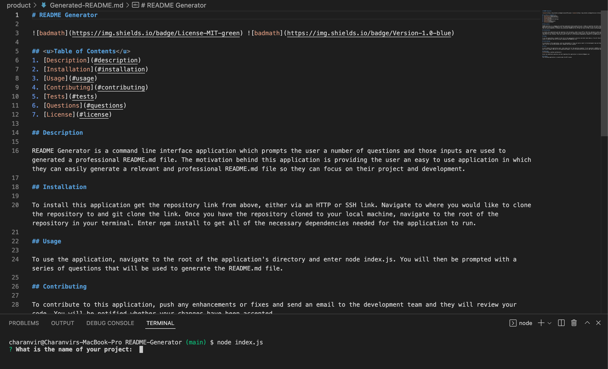
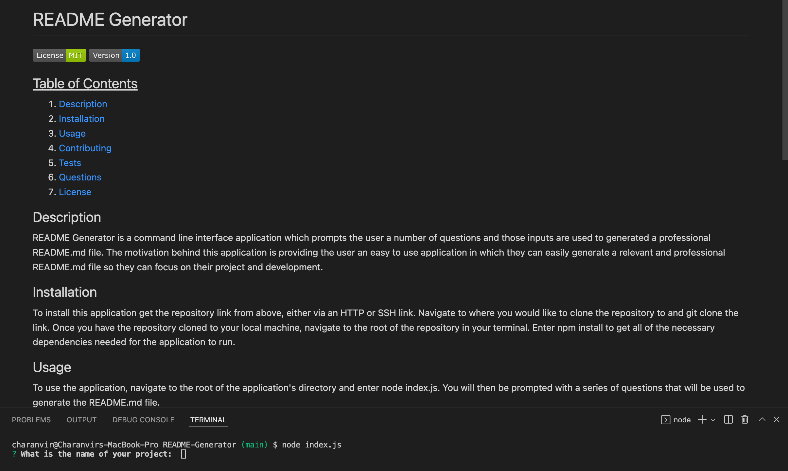

# README.md Generator

  

## <u>Table of Contents</u>
1. [Description](#description)
2. [Installation](#installation)
3. [Usage](#usage)
4. [Contributing](#contributing)
5. [Questions](#questions)
6. [License](#license)

## Description
***

README Generator is a command line interface application which prompts the user a number of questions and those inputs are used to generated a professional README.md file. 

The motivation behind this application is providing the user an easy to use application in which they can easily generate a relevant and professional README.md file so they can focus on their project and development. 

## Installation
***

To install this application get the repository link from above, either via an HTTP or SSH link. 

```
git clone 
```

Once you have the repository cloned to your local machine, navigate to the root of the repository in your terminal.

```
npm install
```

This will install all the necessary dependencies that are needed for the application to run.


## Usage
***

To use this application, navigate to the root of this repository in the terminal and enter the following command 

```
node index.js
```

The user will be prompted with a series of questions that will be used to generate a README.md file.

The following images show the markdown generated from the application and a preview of the README.md file generated.

 

The following is a link to a video which shows how the application is used: [README.md Generator Walkthrough Video](https://vimeo.com/699325065)

## Contributing
***

To contribute to this application, push any enhancements and changes you code and send an email to charanvir123@gmail.com. The developer will get back to you if they wish to implement any of the code changes you've made. 

## Questions
***
To view more projects visit this [Github](https://github.com/Charanvir) account.

Direct any additional questions you have regarding this application to charanvir123@gmail.com

## License
***
The following application is covered under the MIT License
